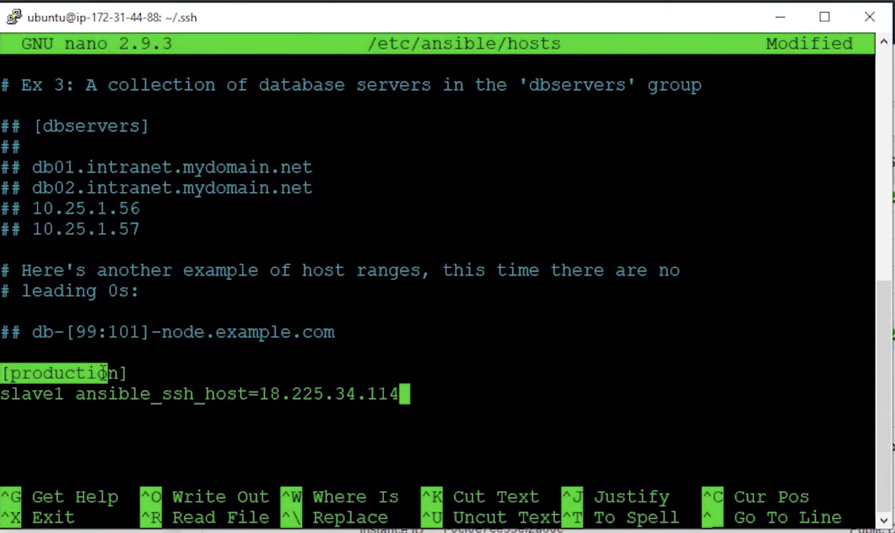

# Ansible_AWS
Install Ansible on AWS EC2 instances.

## Steps to take
1) Step1: Install Ansible on master.
2) Step2: Configure SSH Access to Ansible.
3) Step3: Setting up ansible and testing connection.

## Step1: Install Ansible on master.

1. **Launch instances**
- we are going to launch two instances
- Ubuntu
- t2.micro
- Configure Security Group
- name yuour instances
- connect to yuour instances
   After connecting to the instances we are going to update the master instance.

 
 2. **Master Ansible installation commands.**
  `sudo apt-get update` -  will update the ubuntu
  `sudo apt install software-properties-common`- will install software but usually they are up to date.
  `sudo apt-add-repository ppa:ansible/ansible` - will add ansible repository to the master.
  `sudo apt update` - will update the installations
  `sudo apt install ansible` -  will install ansible in our master.

3. **On Host or Slave**
  `sudo apt-get update` - need to update everyting.
  `sudo apt-get install python` - install only python and no ansible software needs to be installed.
  Note: Make sure that both are ready.

## Step2: Configure SSH Access to Ansible. 

1. Generate the keys on your master `ssh-keygen` 
2. Copy the public keys of your master and put it under `authorized_keys` in your slave.
3. Test it by sshing to the slave.

## Step3: Setting up ansible and testing connection
1. You have to add ansible in the `/etc/ansible/hosts`
2. We need to add the Ip to the known hosts. Give any name. We will just name it [production] and random name "slave1" `ansible_ssh_host=ip_of_the_slave` save it.

3. Run `ansible -m ping all` command which will communicate with your slave. 
  You can also ping the group name that are "productuion" in our case `ansible -m ping production` 
  You can also check the slave1 `ansible -m ping slave1`