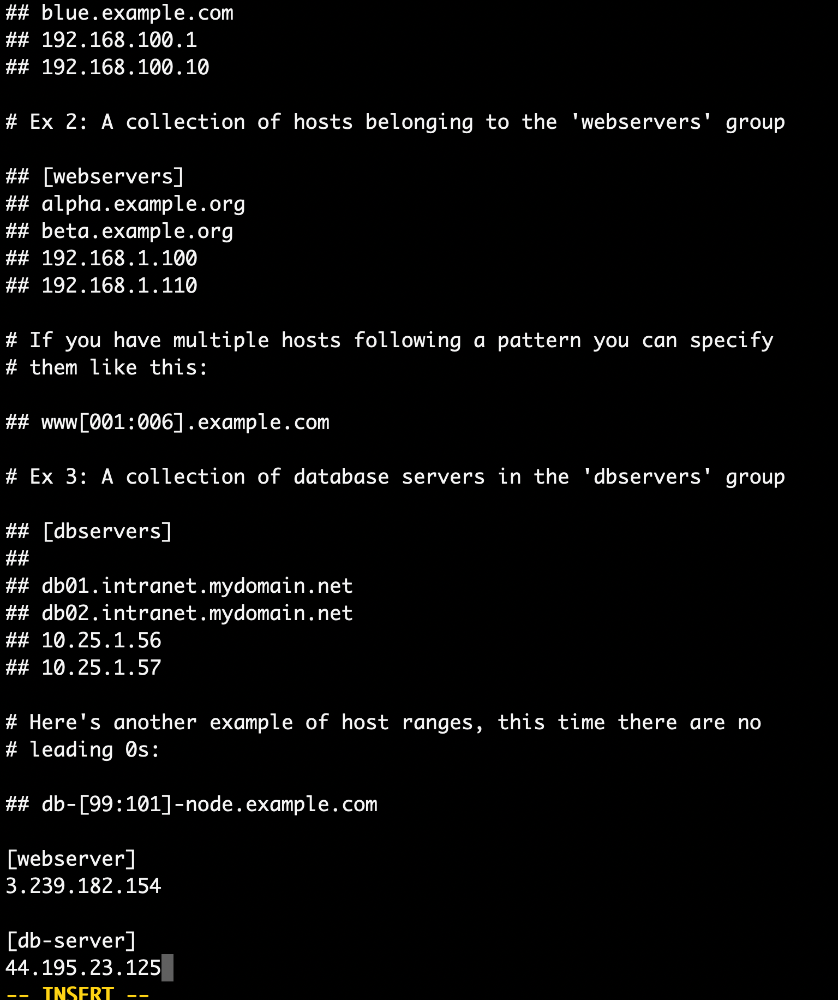

# Ansible Installation with RedHat Enterprise

- 1 Control Node (RedHat Enterprise) 
- 2 Remote Hosts Amazon Linux
- Both Security Groups are open to port 22 (0.0.0.0/0) you can customize it upon your need.

###  <tt> STEP1 Configure Control Node </tt> 
1. SSH to Control Node and update the server - `sudo yum udpate`
2. Install RPEL. This is RPEL link from https://fedoraproject.org/wiki/EPEL
  **Note:** For Ansible installation it is good to use RedHat Image.
3. Install the this packages sudo yum install https://dl.fedoraproject.org/pub/epel/epel-release-latest-8.noarch.rpm
4. Install Ansible `sudo yum install ansible`
5. Check the version of the ansible `ansinble --version` 
6. Become a root ` sudo su - ` from ec2-user and modify the **/etc/ansible/host** we are going to add webserver and db-server groups on the picture below remote hosts as of now.
 

7. Create an user for ansible control node. Make sure you are creating it as root. Best practice to use user other than root. 
  `useradd -d /home/usercontrolnode -m usercontrolnode`

8. Create a password 
`passwd usercontorlnode`
9. Make this password non-expirable. 
`passwd -x -1 usercontrolnode`
10. Become a root and chnange the ownership of the /etc/ansible from root to usercontorlnode
  `chown usercontorlnode:usercontorlnode /etc/ansible`

###  <tt> STEP2 Configure Remote Host1 </tt>
1. SSH to Host1 and update the server - `sudo yum udpate`
2. Become a root and create a user.
  `useradd -d /home/host1 -m host1`
3. Create a password 
  `passwd host1`
4. Make non-expirable password
  ` passwd -x -1 host1`
5. After Creating a user switch to user 
  `su - host1`
6. In the host1 home directory create a folder .ssh
7. Change permission to .ssh folder
  `chmod 700 .ssh`
8. Go to the .ssh directory and create a ssh-keys
  `ssh-keygen` 
9. Create a file `authorized_keys` in the .ssh change the file permission to 600. copy the public keys of the host1 and put public keys in the `authorized_keys` of the host1
10. Copy the private keys of the host1 `id_rsa` we are going to put it inside the file in the cntrolnode user. 

### <tt> Step 3 Establish connection. </tt>
1. Important step: Go to the `usercontrolnode` user and create a file `touch host1.key` and paste private key of the host1. 
2. Change the permission of the file to `chmod 600 host1.key`
3. Test the connection with the command 
  `ssh -p22 -i /etc/ansible/host1.key(path to your key) webserver@ipaddress` 
4. Check if the connection is successful. 

### <tt> Step 4 Configure Ansible Host file. </tt>
1. Go to the control node /etc/ansible/hosts and configure the hosts fiile as of following. 
  [webservers] 
  `54.164.166.210 ansible_ssh_user=webserver ansible_ssh_private_key_file=/etc/ansible/host1.key` 
2. Ping the webserver with ansible ad-hoc command. 
  `ansible webservers -m ping`